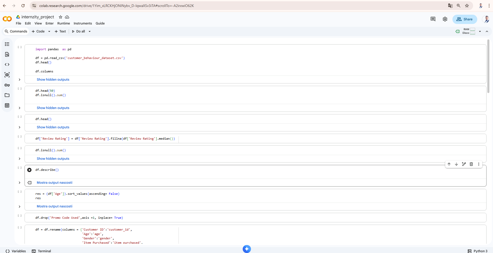
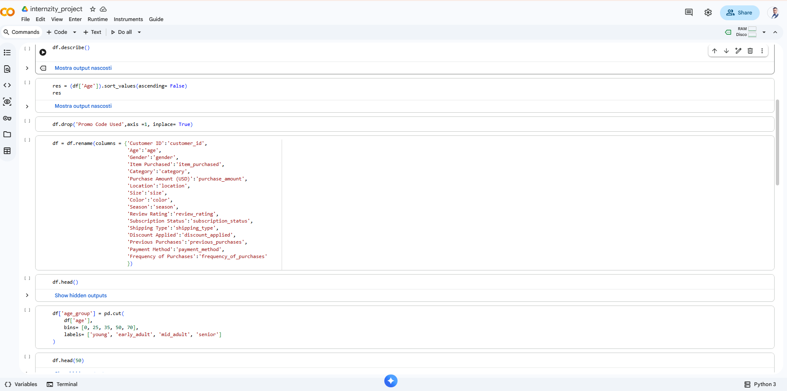

# Customer-Behaviour-Analysis

##     Overview
####   This project analyzes customer shopping behavior to uncover insights that improve sales performance, customer satisfaction, discount users, revenue based on age group and long-term loyalty. The analysis covers purchasing patterns, demographics, product preferences, product subscription pattern and sales channels.

## 		Expected Insights:
At the end of this project we would be able to uncover or answer the following questions:
#### 	1. Which gender contributes more revenue?
####    2. Which age group spends the most?
####    3. Do discounts increase revenue or reduce margins?
####    4. Are subscribers more valuable than non-subscribers?
####    5. Which products and category performs best?
####    6. Are repeat buyers more likely to subscribe?

	
##        Dataset Description:
```python
#   Column                      Non-Null Count  Dtype   
---  ------                    --------------  -----   
 0   customer_id                     3900 non-null   int64   
 1   age                             3900 non-null   int64   
 2   gender                          3900 non-null   object  
 3   item_purchased                  3900 non-null   object  
 4   category                        3900 non-null   object  
 5   purchase_amount                 3900 non-null   int64   
 6   location                        3900 non-null   object  
 7   size                            3900 non-null   object  
 8   color                           3900 non-null   object  
 9   season                          3900 non-null   object  
 10  review_rating                   3900 non-null   float64 
 11  subscription_status             3900 non-null   object  
 12  shipping_type                   3900 non-null   object  
 13  discount_applied                3900 non-null   object  
 14  previous_purchases              3900 non-null   int64  
 15  payment_method                  3900 non-null   object  
 16  frequency_of_purchases          3900 non-null   object  
 17  age_group                       3900 non-null   category
 18  freq_of_puchase_days            3900 non-null   int64
 19  total_purchase_amount           3900 non-null   int64
 20  total_previous_purchase_amount  3900 non-null   int64
 21  product_rating                  3900 non-null   category
 22  spending_category               3900 non-null   category
 23  customer_segmentation           3900 non-null   category 
dtypes: category(4), float64(1), int64(7), object(12)
memory usage: 560.6+ KB
```

## TOOLS USED: 
####    1. Microsoft SQL
####    2. Python (pandas and numpy)
####    3. Power BI (power query, Dax,  Dashboard visualisation tools).

##        PYTHON DATA CLEANING STEPS:
```python
import pandas  as pd
df = pd.read_csv('customer_behaviour_dataset.csv')
print(df)
```
```python
df.head()              # top 5 table rows

df.columns             #to view the column names

df.isnull().sum()      #summation of null values based on columns

df['Review Rating'] = df['Review Rating'].fillna(df['Review Rating'].median())  #filling of missing values
print(df)

df.describe()          #to describe the numerical columns

df = (df['Age']).sort_values(ascending= False)  #to sort the age column in ascending order
print(df)

df.drop('Promo Code Used',axis =1, inplace= True) #to drop the 'promo code used column'

df = df.rename(columns = {'Customer ID':'customer_id',
                          'Age':'age',
                          'Gender':'gender',
                          'Item Purchased':'item_purchased',
                          'Category':'category',
                          'Purchase Amount (USD)':'purchase_amount',
                          'Location':'location',
                          'Size':'size',
                          'Color':'color',
                          'Season':'season',
                          'Review Rating':'review_rating',
                          'Subscription Status':'subscription_status',
                          'Shipping Type':'shipping_type',
                          'Discount Applied':'discount_applied',
                          'Previous Purchases':'previous_purchases',
                          'Payment Method':'payment_method',
                          'Frequency of Purchases':'frequency_of_purchases'
                          })                                                      #to rename the columns using snake pattern
print(df)
df.head()

df['age_group'] = pd.cut(
    df['age'],
    bins= [0, 25, 35, 50, 70],
    labels= ['young', 'early_adult', 'mid_adult', 'senior']
)                                                                  #grouping the customers ages
df.head(50)


df['freq_of_puchase_days'] = df['frequency_of_purchases'].map({
    'Weekly':7,
    'Bi-Weekly':14,
    'Fortnightly':14,
    'Monthly':30,
    'Every 3 Months':90,
    'Quarterly':90,
    'Annually':365

})                          #converting the frequency of purchase into days

df.head(50)
df.info()                                            #info about the table
df.dtypes                                            #viewing their datatypes
df.isnull().sum()                                    #checking for null values
df.duplicated().sum()                                #checking for duplicates
df[df['freq_of_puchase_days']<=0]                    #checking for inconsistencies
df[df['freq_of_puchase_days']>365]                    #checking for inconsistencies
df.to_csv('customer_behaviour.csv', index = False)         #to save csv file
```
##         SQL ANALYSIS QUERIES:

```sql
                                       ---    REVENUE BY GENDER:

--- calculation of revenue by male_gender:

select 
	gender,
	sum(purchase_amount) as total_purchase_amount 
	from customer_behaviour
	where gender = 'Male'
	group by gender;

select 
	gender,
	sum(previous_purchases) as total_previous_purchase 
	from customer_behaviour
	where gender = 'Male'
	group by gender;


with Revenue_male_gender as (
 select 
  customer_id,
  age,
  gender,
  purchase_amount,
  previous_purchases,
  (purchase_amount) + (previous_purchases) as total_purchases
  from customer_behaviour
  where gender = 'Male'
 )
 select 
  customer_id,
  age,
  gender,
  purchase_amount,
  previous_purchases,
  total_purchases,
  sum(total_purchases) over (partition by gender order by total_purchases desc) as total_revenue 
  from Revenue_male_gender;
  


  --- calculation of revenue by female_gender:

select 
	gender,
	sum(purchase_amount) as total_purchase_amount
	from customer_behaviour
	where gender = 'Female'
	group by gender;

select 
	gender,
	sum(previous_purchases) as total_previous_purchase 
	from customer_behaviour
	where gender = 'Female'
	group by gender;


with Revenue_female_gender as (
 select 
  customer_id,
  age,
  gender,
  purchase_amount,
  previous_purchases,
  (purchase_amount) + (previous_purchases) as total_purchases
  from customer_behaviour
  where gender = 'Female'
 )
 select 
  customer_id,
  age,
  gender,
  purchase_amount,
  previous_purchases,
  total_purchases,
  sum(total_purchases) over (order by total_purchases desc) as total_revenue 
  from Revenue_female_gender;
  

                                        --- HIGH-SPENDING DISCOUNT USERS:
										
-- based on window function:
with high_spending_discount_users  as (	
select 
  customer_id,
  age,
  gender,
  age_group,
  discount_applied,
  sum(purchase_amount) over (partition by age_group)as total_purchases_amount,
  sum(previous_purchases)over (partition by age_group) as total_previous_purchases,
  (purchase_amount) + (previous_purchases) as total_spending
  from customer_behaviour
  where discount_applied = 'Yes'
  
  )
select
  customer_id,
  age,
  gender,
  age_group,
  discount_applied,
  total_purchases_amount,
  total_previous_purchases,
  sum(total_spending) over() total_spending,
  case when total_spending >= 101 then 'high_disc_spending'
	   when total_spending between 51 and 100 then 'medium_disc_speding'
	   else 'low_disc_spending'
	   end as spending_category
  from high_spending_discount_users;
 

 -- based on group by:    
 with high_spending_discount_users  as (	
select 
  customer_id,
  age,
  gender,
  age_group,
  discount_applied,
  sum(purchase_amount) as total_purchases_amount,
  sum(previous_purchases) as total_previous_purchases,
  (purchase_amount) + (previous_purchases) as total_spending
  from customer_behaviour
  where discount_applied = 'Yes'
  group by 
		customer_id,
		age,
		gender,
		age_group,
		discount_applied,
		(purchase_amount) + (previous_purchases)
  )
select
  customer_id,
  age,
  gender,
  age_group,
  discount_applied,
  total_purchases_amount,
  total_previous_purchases,
  total_spending,
  case when total_spending >= 101 then 'high_disc_spending'
	   when total_spending between 51 and 100 then 'medium_disc_speding'
	   else 'low_disc_spending'
	   end as spending_category
  from high_spending_discount_users;


            --- TOP RATED PRODUCTS :
with rated_products as (
select
	customer_id,
	category,
	size,
	color,
	season,
	item_purchased,
	review_rating,
	round(avg(review_rating) over (),2) as average_rating
from customer_behaviour
)
select
	customer_id,
	category,
	size,
	color,
	season,
	item_purchased,
	review_rating,
	average_rating,
	case when review_rating >= 4.5 then 'top_rated'
	     when review_rating between 4 and 4.4 then 'highly_rated'
		 when review_rating between 3 and 3.9  then 'average_rated'
		 else 'poorly_rated'
		 end as product_rating
	from rated_products;
	


								---- CUSTOMER SEGMENTATION:

select
	customer_id,
	age,
	gender,
	item_purchased,
	category,
	location,
	age_group,
	subscription_status,
	freq_of_puchase_days,
case when freq_of_puchase_days between 7 and 30 then 'loyal'
	 when freq_of_puchase_days between 31 and 90 then 'returning'
	 else 'new'
	 end as customer_segmentation
from customer_behaviour;
	


												 -------   CUSTOMER REPORT:


go
create view dbo.customer_behaviour_analysis 
as 
with customer_report as (	
select
	customer_id,
	age,
	gender,
	item_purchased,
	category,
	location,
	size,
	color,
	season,
	review_rating,
	subscription_status,
	shipping_type,
	discount_applied,
	payment_method,
	frequency_of_purchases,
	age_group,
	sum(purchase_amount) as total_purchase_amount,
	sum(previous_purchases) as total_previous_purchase,
	(purchase_amount) + (previous_purchases) as total_spending,
	freq_of_puchase_days
from customer_behaviour
group by 
	customer_id,
	age,
	gender,
	item_purchased,
	category,
	location,
	size,
	color,
	season,
	review_rating,
	subscription_status,
	shipping_type,
	discount_applied,
	payment_method,
	frequency_of_purchases,
	age_group,
	(purchase_amount) + (previous_purchases),
	freq_of_puchase_days
)
select
	customer_id,
	age,
	gender,
	item_purchased,
	category,
	location,
	size,
	color,
	season,
	review_rating, 
case when review_rating >= 4.5 then 'top_rated'
	 when review_rating between 4 and 4.4 then 'highly_rated'
	 when review_rating between 3 and 3.9  then 'average_rated'
	 else 'poorly_rated'
	 end as product_rating,
	subscription_status,
	shipping_type,
	discount_applied,
	payment_method,
	frequency_of_purchases,
	age_group,
	total_purchase_amount,
	total_previous_purchase,
	total_spending,
case when total_spending >= 101 then 'high_disc_spending'
	 when total_spending between 51 and 100 then 'medium_disc_speding'
	 else 'low_disc_spending'
	 end as spending_category,
	freq_of_puchase_days,
case when freq_of_puchase_days between 7 and 30 then 'loyal'
	 when freq_of_puchase_days between 31 and 90 then 'returning'
	 else 'new'
	 end as customer_segmentation
from customer_report
go;


select * from customer_behaviour_analysis;
```






## KPIs DEFINED
####  1. Total Revenue = (332k)
 This the total revenue generated accross different product categories and products 
 
####  2. Average Purchase / AOV = (85)
 The average value of a single transaction (average cart).
 This indicates a significant amount of money an individual customer is willing to spend at a time .
 
####  3. Total Customers (4k)
 The size of the total customer base.
 This simply indicates that  4,000 people have trusted the brand. 
 
####  4. % Repeat Purchase = (29% or 0.29)
 The percentage of customers who placed more than one order.
 This is a key indicator of loyalty .
 
####  5. Avg Rating = (3.75 / 5)
 The average rating given by customers. 
 This tells a lot about customers satisfaction derievd from a product or service.
 It has a high impact to play on customers retention.
 
####  6. % Subscribed Users = (0.27)
 This data indicates the number of customers that have subscribed to the brand . 
 A high percentage of subscribers means the customer wants to stay in touch with the brand. 
 It's the most cost-effective channel for increasing repeat purchases through newsletters or dedicated offers.

## KEY INSIGHTS:
#### 1. GENDER (MALE GENDER):
		The male gender generates the highest revenue of 226k out total revenue of 332k, 
		and it contributes about 68% of the total revenue. This indicates that male gender contributes largely than female gender in terms of revenue generations.

#### 2. AGE GROUP (senior):
        The customers that are in the 'senior' age-group spends more than the rest of other age-groups,
		At the total spending of 88k out of 332k, this represents about 26.5% of the total spending.
		
#### 3. DISCOUNT IMPACT:
        The discount impacted hugely to a total of 189k which represent a 55% of the total revenue of 332k.
		That is to say that it increases the revenue with 55% contribution.

#### 4. SUBSCRIBERS VS NON-SUBSCRIBERS:
		Subscribers generates a revenue of 90k which represents 27% of the total revenue.
		Non-Subscribers generates a revenue of 242k which as well represents 73% of the total revenue of 332k.
		In this case, having compared the Subscribers and Non-Subscribers, we noticed the Non-Subscribers are more valuable than Subscribers.

#### 5. PRODUCT AND CATEGORY BEST PERFORMANCE:
        The product 'Blouse','Dress', 'Shirt' and category 'Clothing' has the best performance which has the revenue contributions of 15k each and 148k respectively.
		This indicates that customers purchases more products from clothing category than any other category.
        
#### 6. REPEAT BUYERS:
        Repeat purchase or buyers  stands at 29.69% which represent about 99,000. Although the total subscribers stands at 0.27%.
		The chance at which the repeat buyers may likely subscribe is high.


##       CONCLUSION:
####     The men's engine: 
		 With 68% of your revenue , the men's segment is the cornerstone. 
		 It would be interesting to understand whether this is due to the product catalog or a targeted marketing strategy.
		 
####     The value of "Seniors": 
		 Despite having 4 age group, they generate 26.5% of spending . 
		 They are an audience with high purchasing power that deserves dedicated campaigns.
		 
####     Discount dependence: 
         The fact that 55% of the revenue comes from discounts suggests that the customers are highly price sensitive. 
		 This increases volume, but could erode long-term margins.
		 
####     The Subscriber Paradox: 
         Non-subscribers bring in 73% of revenue . This indicates enormous untapped potential: 
		 we have many loyal customers (29.69% repeat purchases) who haven't yet made the leap to a subscription.
		 
####     Clothing Category Efficiency:
		 The Clothing category generates almost 45% of total turnover (148k out of 332k), with Blouses, Dresses and Shirts leading the way.
		 Insight: These are the "lead products." Given that men are the main contributors (68%), "Shirts" are likely the key driver of men's sales volumes.
		 Action: Optimize cross-selling. If a man buys a shirt, offer accessories or pants (potentially underperforming categories) to increase the average purchase price without resorting to further discounts.

####     ACTIONABLE TIPS:
		 Given the high rate of repeat purchases (almost 30%) compared to the low share of subscribers (27%), 
		 we could create a specific conversion campaign for "Repeat Buyers", offering them a special incentive to subscribe.
