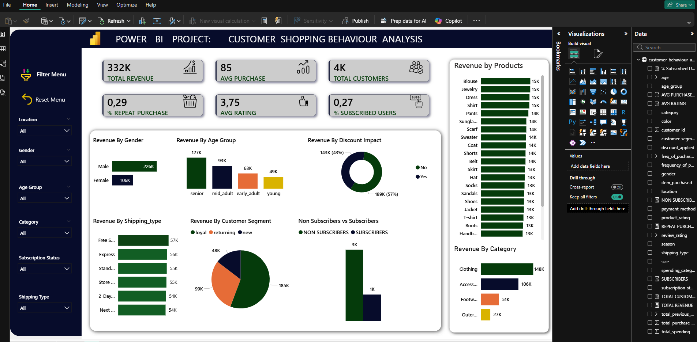
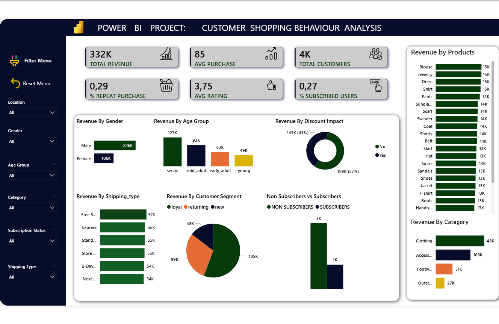
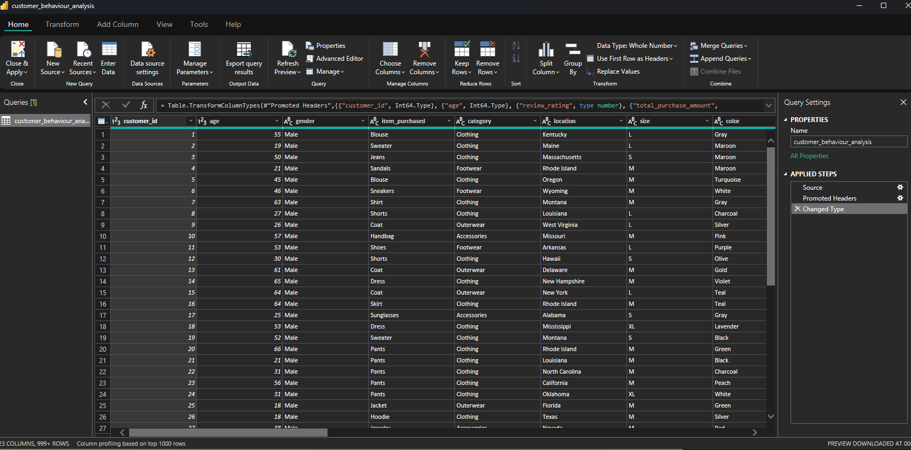
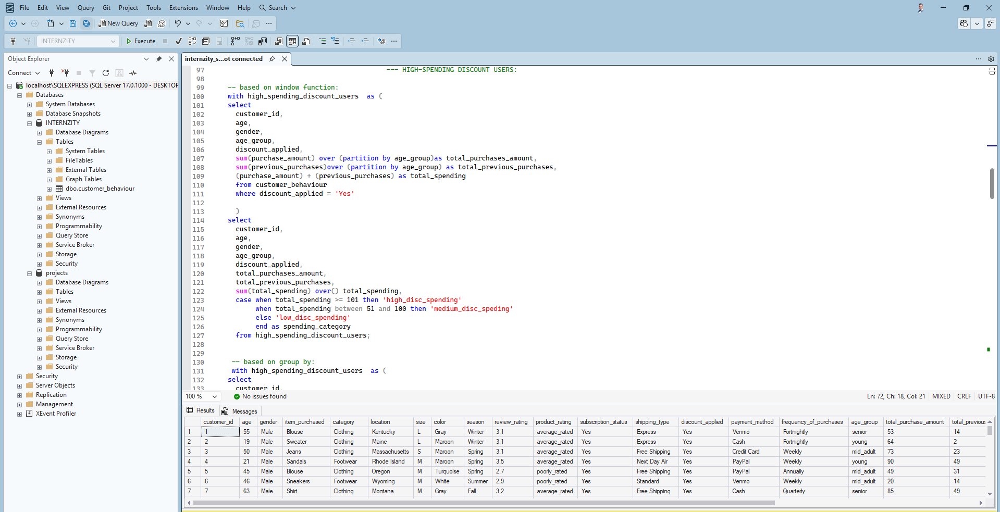
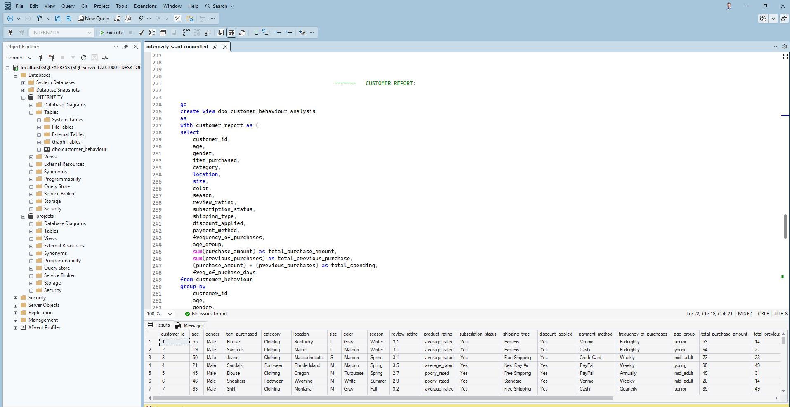

# Customer-Behaviour-Analysis

##     Overview
####   This project analyzes customer shopping behavior to uncover insights that improve sales performance, customer satisfaction, discount users, revenue based on age group and long-term loyalty. The analysis covers purchasing patterns, demographics, product preferences, product subscription pattern and sales channels.


##        Dataset Description:
```python
#   Column                      Non-Null Count  Dtype   
---  ------                    --------------  -----   
 0   customer_id                     3900 non-null   int64   
 1   age                             3900 non-null   int64   
 2   gender                          3900 non-null   object  
 3   item_purchased                  3900 non-null   object  
 4   category                        3900 non-null   object  
 5   purchase_amount                 3900 non-null   int64   
 6   location                        3900 non-null   object  
 7   size                            3900 non-null   object  
 8   color                           3900 non-null   object  
 9   season                          3900 non-null   object  
 10  review_rating                   3900 non-null   float64 
 11  subscription_status             3900 non-null   object  
 12  shipping_type                   3900 non-null   object  
 13  discount_applied                3900 non-null   object  
 14  previous_purchases              3900 non-null   int64  
 15  payment_method                  3900 non-null   object  
 16  frequency_of_purchases          3900 non-null   object  
 17  age_group                       3900 non-null   category
 18  freq_of_puchase_days            3900 non-null   int64
 19  total_purchase_amount           3900 non-null   int64
 20  total_previous_purchase_amount  3900 non-null   int64
 21  product_rating                  3900 non-null   category
 22  spending_category               3900 non-null   category
 23  customer_segmentation           3900 non-null   category 
dtypes: category(4), float64(1), int64(7), object(12)
memory usage: 560.6+ KB
```

##        PYTHON DATA CLEANING STEPS:
```python
import pandas  as pd
df = pd.read_csv('customer_behaviour_dataset.csv')
print(df)
```
```python
df.head()              # top 5 table rows

df.columns             #to view the column names

df.isnull().sum()      #summation of null values based on columns

df['Review Rating'] = df['Review Rating'].fillna(df['Review Rating'].median())  #filling of missing values
print(df)

df.describe()          #to describe the numerical columns

df = (df['Age']).sort_values(ascending= False)  #to sort the age column in ascending order
print(df)

df.drop('Promo Code Used',axis =1, inplace= True) #to drop the 'promo code used column'

df = df.rename(columns = {'Customer ID':'customer_id',
                          'Age':'age',
                          'Gender':'gender',
                          'Item Purchased':'item_purchased',
                          'Category':'category',
                          'Purchase Amount (USD)':'purchase_amount',
                          'Location':'location',
                          'Size':'size',
                          'Color':'color',
                          'Season':'season',
                          'Review Rating':'review_rating',
                          'Subscription Status':'subscription_status',
                          'Shipping Type':'shipping_type',
                          'Discount Applied':'discount_applied',
                          'Previous Purchases':'previous_purchases',
                          'Payment Method':'payment_method',
                          'Frequency of Purchases':'frequency_of_purchases'
                          })                                                      #to rename the columns using snake pattern
print(df)
df.head()

df['age_group'] = pd.cut(
    df['age'],
    bins= [0, 25, 35, 50, 70],
    labels= ['young', 'early_adult', 'mid_adult', 'senior']
)                                                                  #grouping the customers ages
df.head(50)


df['freq_of_puchase_days'] = df['frequency_of_purchases'].map({
    'Weekly':7,
    'Bi-Weekly':14,
    'Fortnightly':14,
    'Monthly':30,
    'Every 3 Months':90,
    'Quarterly':90,
    'Annually':365

})                          #converting the frequency of purchase into days

df.head(50)
df.info()                                            #info about the table
df.dtypes                                            #viewing their datatypes
df.isnull().sum()                                    #checking for null values
df.duplicated().sum()                                #checking for duplicates
df[df['freq_of_puchase_days']<=0]                    #checking for inconsistencies
df[df['freq_of_puchase_days']>365]                    #checking for inconsistencies
df.to_csv('customer_behaviour.csv', index = False)         #to save csv file
```
##         SQL ANALYSIS QUERIES:

```sql
                                       ---    REVENUE BY GENDER:

--- calculation of revenue by male_gender:

select 
	gender,
	sum(purchase_amount) as total_purchase_amount 
	from customer_behaviour
	where gender = 'Male'
	group by gender;

select 
	gender,
	sum(previous_purchases) as total_previous_purchase 
	from customer_behaviour
	where gender = 'Male'
	group by gender;


with Revenue_male_gender as (
 select 
  customer_id,
  age,
  gender,
  purchase_amount,
  previous_purchases,
  (purchase_amount) + (previous_purchases) as total_purchases
  from customer_behaviour
  where gender = 'Male'
 )
 select 
  customer_id,
  age,
  gender,
  purchase_amount,
  previous_purchases,
  total_purchases,
  sum(total_purchases) over (partition by gender order by total_purchases desc) as total_revenue 
  from Revenue_male_gender;
  


  --- calculation of revenue by female_gender:

select 
	gender,
	sum(purchase_amount) as total_purchase_amount
	from customer_behaviour
	where gender = 'Female'
	group by gender;

select 
	gender,
	sum(previous_purchases) as total_previous_purchase 
	from customer_behaviour
	where gender = 'Female'
	group by gender;


with Revenue_female_gender as (
 select 
  customer_id,
  age,
  gender,
  purchase_amount,
  previous_purchases,
  (purchase_amount) + (previous_purchases) as total_purchases
  from customer_behaviour
  where gender = 'Female'
 )
 select 
  customer_id,
  age,
  gender,
  purchase_amount,
  previous_purchases,
  total_purchases,
  sum(total_purchases) over (order by total_purchases desc) as total_revenue 
  from Revenue_female_gender;
  

                                        --- HIGH-SPENDING DISCOUNT USERS:
										
-- based on window function:
with high_spending_discount_users  as (	
select 
  customer_id,
  age,
  gender,
  age_group,
  discount_applied,
  sum(purchase_amount) over (partition by age_group)as total_purchases_amount,
  sum(previous_purchases)over (partition by age_group) as total_previous_purchases,
  (purchase_amount) + (previous_purchases) as total_spending
  from customer_behaviour
  where discount_applied = 'Yes'
  
  )
select
  customer_id,
  age,
  gender,
  age_group,
  discount_applied,
  total_purchases_amount,
  total_previous_purchases,
  sum(total_spending) over() total_spending,
  case when total_spending >= 101 then 'high_disc_spending'
	   when total_spending between 51 and 100 then 'medium_disc_speding'
	   else 'low_disc_spending'
	   end as spending_category
  from high_spending_discount_users;
 

 -- based on group by:    
 with high_spending_discount_users  as (	
select 
  customer_id,
  age,
  gender,
  age_group,
  discount_applied,
  sum(purchase_amount) as total_purchases_amount,
  sum(previous_purchases) as total_previous_purchases,
  (purchase_amount) + (previous_purchases) as total_spending
  from customer_behaviour
  where discount_applied = 'Yes'
  group by 
		customer_id,
		age,
		gender,
		age_group,
		discount_applied,
		(purchase_amount) + (previous_purchases)
  )
select
  customer_id,
  age,
  gender,
  age_group,
  discount_applied,
  total_purchases_amount,
  total_previous_purchases,
  total_spending,
  case when total_spending >= 101 then 'high_disc_spending'
	   when total_spending between 51 and 100 then 'medium_disc_speding'
	   else 'low_disc_spending'
	   end as spending_category
  from high_spending_discount_users;


            --- TOP RATED PRODUCTS :
with rated_products as (
select
	customer_id,
	category,
	size,
	color,
	season,
	item_purchased,
	review_rating,
	round(avg(review_rating) over (),2) as average_rating
from customer_behaviour
)
select
	customer_id,
	category,
	size,
	color,
	season,
	item_purchased,
	review_rating,
	average_rating,
	case when review_rating >= 4.5 then 'top_rated'
	     when review_rating between 4 and 4.4 then 'highly_rated'
		 when review_rating between 3 and 3.9  then 'average_rated'
		 else 'poorly_rated'
		 end as product_rating
	from rated_products;
	


								---- CUSTOMER SEGMENTATION:

select
	customer_id,
	age,
	gender,
	item_purchased,
	category,
	location,
	age_group,
	subscription_status,
	freq_of_puchase_days,
case when freq_of_puchase_days between 7 and 30 then 'loyal'
	 when freq_of_puchase_days between 31 and 90 then 'returning'
	 else 'new'
	 end as customer_segmentation
from customer_behaviour;
	


												 -------   CUSTOMER REPORT:


go
create view dbo.customer_behaviour_analysis 
as 
with customer_report as (	
select
	customer_id,
	age,
	gender,
	item_purchased,
	category,
	location,
	size,
	color,
	season,
	review_rating,
	subscription_status,
	shipping_type,
	discount_applied,
	payment_method,
	frequency_of_purchases,
	age_group,
	sum(purchase_amount) as total_purchase_amount,
	sum(previous_purchases) as total_previous_purchase,
	(purchase_amount) + (previous_purchases) as total_spending,
	freq_of_puchase_days
from customer_behaviour
group by 
	customer_id,
	age,
	gender,
	item_purchased,
	category,
	location,
	size,
	color,
	season,
	review_rating,
	subscription_status,
	shipping_type,
	discount_applied,
	payment_method,
	frequency_of_purchases,
	age_group,
	(purchase_amount) + (previous_purchases),
	freq_of_puchase_days
)
select
	customer_id,
	age,
	gender,
	item_purchased,
	category,
	location,
	size,
	color,
	season,
	review_rating, 
case when review_rating >= 4.5 then 'top_rated'
	 when review_rating between 4 and 4.4 then 'highly_rated'
	 when review_rating between 3 and 3.9  then 'average_rated'
	 else 'poorly_rated'
	 end as product_rating,
	subscription_status,
	shipping_type,
	discount_applied,
	payment_method,
	frequency_of_purchases,
	age_group,
	total_purchase_amount,
	total_previous_purchase,
	total_spending,
case when total_spending >= 101 then 'high_disc_spending'
	 when total_spending between 51 and 100 then 'medium_disc_speding'
	 else 'low_disc_spending'
	 end as spending_category,
	freq_of_puchase_days,
case when freq_of_puchase_days between 7 and 30 then 'loyal'
	 when freq_of_puchase_days between 31 and 90 then 'returning'
	 else 'new'
	 end as customer_segmentation
from customer_report
go;


select * from customer_behaviour_analysis;
```





